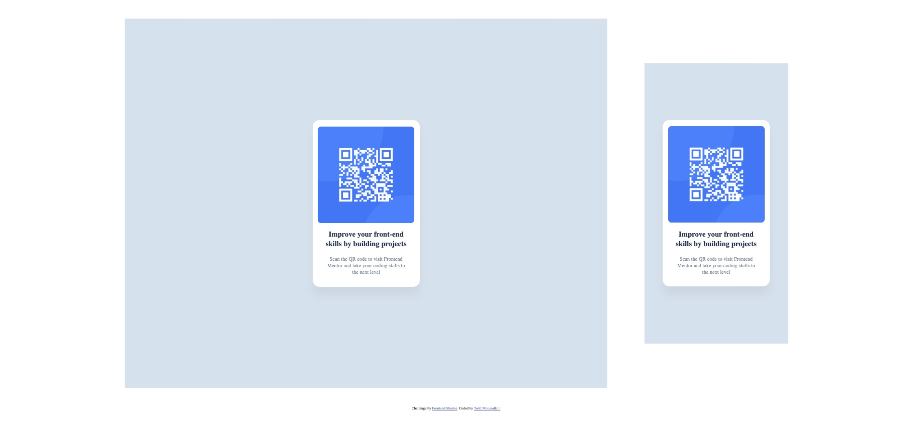

## Table of contents

- [Overview](#overview)
  - [Screenshot](#screenshot)
  - [Links](#links)
- [My process](#my-process)
  - [Built with](#built-with)
  - [Continued development](#continued-development)
  - [Useful resources](#useful-resources)
- [Author](#author)
- [Acknowledgments](#acknowledgments)

## Overview

This was a simple project that I completed in order to practice basic HTML and CSS. This project is a CR Code for a website that I have utilized while learning Front End Development called Front End Mentor.

### Screenshot

### Links

- Live Site URL: (https://rtoddm.github.io/qr-code/)

## My process

1. I began by initializing my project as a public repository on [GitHub](https://github.com/).
2. Then I configured my repository to publish my code to a web address (GitHub pages).
3. I looked through the designs in order to plan how I'd tackle the project. This step is important to help you think through potential CSS classes to create reusable styles.
4. However, before worrying about any styles, I structured my HTML content.
5. I then wrote out the basic styles for my project such as `font-family` and `font-size`, etc.
6. Then I started adding CSS styles to the top of the page and worked down.

### Built with

- Semantic HTML5 markup
- CSS custom properties
- Flexbox

### Continued development

Moving forward I plan on focusing on utilizing JavaScript and React in my projects. Additionally, I want to perfect my CSS abilities and begin using Bootstrap as well.

### Useful resources

- [Resource 1](https://flexbox.malven.co/) - This site helped me conceptualize Flexbox options as I completed this project. It is a good reference tool when using Flexbox.

## Author

- Frontend Mentor - [@rtoddm](https://www.frontendmentor.io/profile/rtoddm)
- LinkedIn -[Todd Moussallem](https://www.linkedin.com/in/todd-m-1a7aa8215)
- GitHub -[@rtoddm](https://rtoddm.github.io/git-repo-gallery/)
